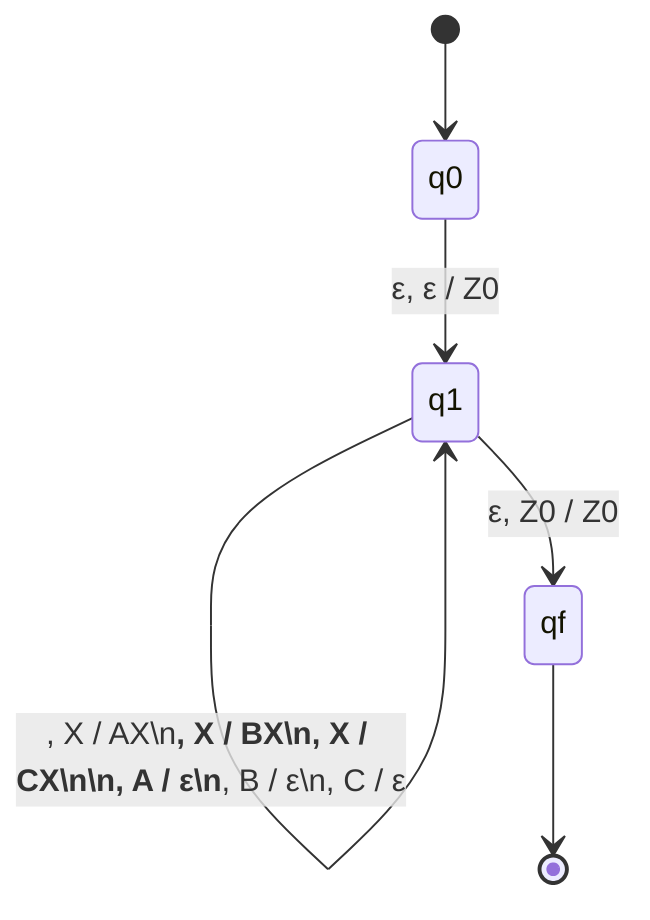

# Reporte del Proyecto: Autómata de Pila - Validación de Etiquetas HTML/XML

**Materia:** Lenguajes Formales y Autómatas
**Fecha de entrega:** 19/Junio/2026
**Lenguaje de programación:** C

*(Nota: Rellenar Nombre del alumno y Equipo según corresponda)*
**Nombre del alumno:** 
**Equipo:** 

---

## 1. Objetivo del proyecto
Diseñar, explicar e implementar un autómata de pila (PDA) que valide cadenas con etiquetas tipo HTML/XML correctamente balanceadas. El proyecto permite evaluar el uso de pila, transiciones, símbolos terminales, símbolos de pila, aceptación y simulación computacional.

## 2. Descripción del problema
Se trabaja con un lenguaje simplificado de etiquetas HTML/XML usando solamente tres tipos de etiquetas:
- ``
- `<b>   </b>`
- `<c>   </c>`

Una cadena es válida si cada etiqueta de apertura tiene su etiqueta de cierre correspondiente y si el cierre ocurre en el orden correcto. Esto significa que la última etiqueta que se abre debe ser la primera que se cierra, funcionando exactamente igual que una pila (LIFO - Last In, First Out).

## 3. Definición del Lenguaje a reconocer
El lenguaje $L$ está formado por cadenas de etiquetas correctamente anidadas y balanceadas. Sus alfabetos se definen como:

- **Alfabeto de entrada ($\Sigma$):** $\{ \langle a \rangle, \langle /a \rangle, \langle b \rangle, \langle /b \rangle, \langle c \rangle, \langle /c \rangle \}$
- **Alfabeto de la pila ($\Gamma$):** $\{ A, B, C, Z_0 \}$

Donde $A, B$ y $C$ son símbolos que se apilan para recordar las etiquetas abiertas, y $Z_0$ es el símbolo inicial de la pila.

## 4. Gramática Libre de Contexto (CFG)
Una gramática que permite generar las etiquetas balanceadas de este lenguaje es:
- $S \rightarrow SS$
- $S \rightarrow \langle a \rangle S \langle /a \rangle$
- $S \rightarrow \langle b \rangle S \langle /b \rangle$
- $S \rightarrow \langle c \rangle S \langle /c \rangle$
- $S \rightarrow \varepsilon$

La producción $S \rightarrow SS$ permite colocar estructuras válidas una después de otra, mientras que las demás producciones permiten el anidamiento. La producción a $\varepsilon$ (vacío) permite terminar las derivaciones.

## 5. Definición Formal del Autómata de Pila (PDA)
El autómata se define formalmente como $M = (Q, \Sigma, \Gamma, \delta, q_0, Z_0, F)$:
- **Conjunto de estados ($Q$):** $\{ q_0, q_1, q_f \}$
- **Estado inicial:** $q_0$
- **Estado de procesamiento:** $q_1$
- **Estado final o de aceptación ($F$):** $\{ q_f \}$
- **Símbolo inicial de la pila:** $Z_0$

### Transiciones principales ($\delta$)
La notación utilizada es: `estado, entrada, cima de pila / reemplazo_en_pila`

1. Inicialización: $\delta(q_0, \varepsilon, \varepsilon) = (q_1, Z_0)$
2. Apilar apertura:
   - $\delta(q_1, \langle a \rangle, X) = (q_1, AX)$
   - $\delta(q_1, \langle b \rangle, X) = (q_1, BX)$
   - $\delta(q_1, \langle c \rangle, X) = (q_1, CX)$
   *(con $X \in \{Z_0, A, B, C\}$)*
3. Desapilar al cerrar:
   - $\delta(q_1, \langle /a \rangle, A) = (q_1, \varepsilon)$
   - $\delta(q_1, \langle /b \rangle, B) = (q_1, \varepsilon)$
   - $\delta(q_1, \langle /c \rangle, C) = (q_1, \varepsilon)$
4. Aceptación:
   - $\delta(q_1, \varepsilon, Z_0) = (q_f, Z_0)$

Si aparece una etiqueta de cierre y no coincide con la cima de la pila, o la entrada termina y la pila no está solo con $Z_0$, la cadena se rechaza.

## 6. Diagrama del Autómata

## 7. Tabla de Cadenas de Prueba

### Cadenas Aceptadas
| # | Cadena | Justificación |
|---|---|---|
| 1 | `` | Apertura simple seguida de su cierre. |
| 2 | `<b></b>` | Apertura simple seguida de su cierre. |
| 3 | `<c></c>` | Apertura simple seguida de su cierre. |
| 4 | `<a><b></b></a>` | Anidamiento correcto de `<b>` dentro de `<a>`. |
| 5 | `<a><b><c></c></b></a>` | Anidamiento en 3 niveles de profundidad. |
| 6 | `<b></b>` | Secuencia generada mediante $S \rightarrow SS$. |
| 7 | `<b></b><c></c>` | Secuencia de tres etiquetas diferentes. |
| 8 | `<c><b></b></c>` | Secuencia contenida dentro del anidamiento de `<c>`. |
| 9 | `<a><b></b><c></c></a>` | Dos estructuras hermanas dentro de la etiqueta `<a>`. |
| 10| `<a><b><c></c></b><c></c></a>` | Estructuras múltiples y anidamiento combinado. |

### Cadenas Rechazadas
| # | Cadena | Justificación del Rechazo |
|---|---|---|
| 1 | `<a>` | Falta la etiqueta de cierre correspondiente. (Queda 'A' en la pila) |
| 2 | `</a>` | Se cierra sin haber abierto. (Pila sin 'A' en la cima) |
| 3 | `<a></b>` | La etiqueta de cierre no coincide con la apertura esperada. |
| 4 | `<a><b></a></b>` | El orden de cierre es incorrecto, violación de LIFO. |
| 5 | `</a><a>` | Se intenta cerrar antes de abrir. |
| 6 | `<a><b></b>` | Falta la etiqueta de cierre de `<a>`. |
| 7 | `</b>` | Hay una etiqueta de cierre extra al final. |
| 8 | `<a><b><c></c></a></b>` | Se cruzaron etiquetas; `<b>` no cerró antes que `<a>`. |
| 9 | `<a><b></c></b></a>` | Se intenta cerrar `<c>` pero la cima es `B`. |
| 10| `<b>` | Falta el cierre del segundo elemento secuencial. |

## Autores

- **Joahan Josue Cruz Mancilla**
- **Paloma Tsitsiki Arellano Alejo**
- **Brando Eretza Visoso**
